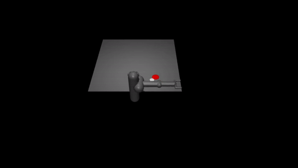
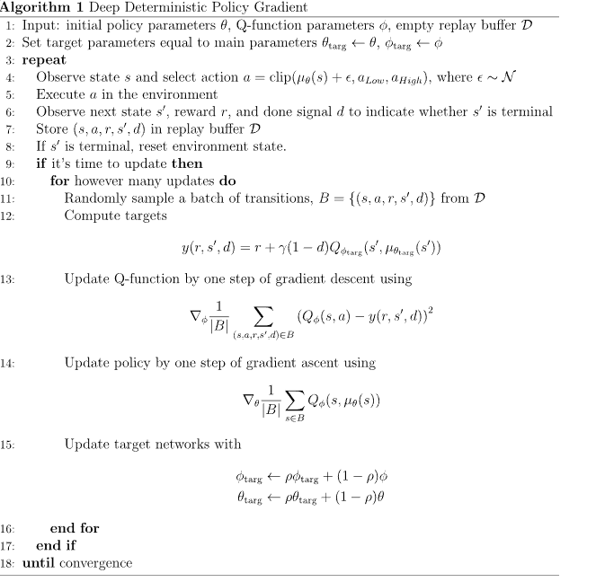

<p align="center">
  
</p>


# DDPG and PPO on Gymnasium Pusher
This repository holds the code for a project in Reinforcement learning.

Pusher” is a multi-jointed robot arm which is very similar to that of a human. The goal is to move a target cylinder (called object) to a goal position using the robot’s end effector (called fingertip). The robot consists of shoulder, elbow, forearm, and wrist joints.

## Deep Deterministic Policy Gradient (DDPG)
For this project we are using DDPG. Below is the psudocode used when implementing DDPG.



## Before running project

### Use Anaconda (preferable)
```bash
conda create --name pusher python==3.10
conda activate pusher
```

### Install PyTorch
```bash
pip install torch
```

### Install dependencies
```bash
pip install -r requirements.txt
```
### If libGL error encounter, run:
```bash
conda install -c conda-forge libstdcxx-ng
```
